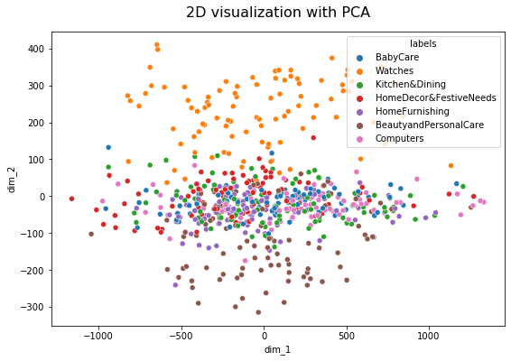
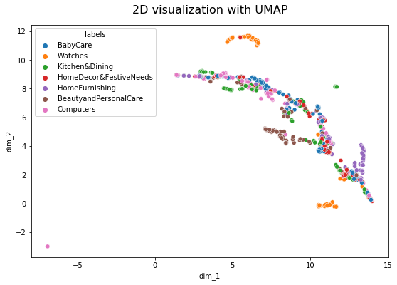
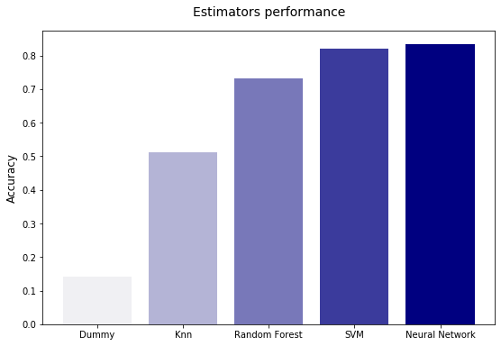

# Classifying products

## Project overview

* The goal of this project is to evaluate the **feasibility** of an automatic **classification** that would predict product **categories** upon **images** and/or **text**

* We will therefore implement **Computer Vision** and **Natural Language Processing** techniques

* Since the data is **labeled** we will consider it a **supervised multi-label classification** task

* the overall **performance** of the **fitted model** is **strong** and thus confirms the **feasibility** of the **automatic classification** 
&nbsp;

## Workflow summary

* **explored** the target variables 

* implemented **Computer vision feature extraction techniques** : 
    * Bag of Visual Words with SIFT
    * Transfer learning with CNNs

* trained linear and non-linear estimators on extracted features and compared their performance on a validation set

* implemented **NLP feature extraction techniques** :
    * Universal Sentence Encoder
    * Bag of Words
    * Term-frequency inverse document-frequency
    * LDA

* trained linear and non-linear estimators on **extracted features** and compared their performance on a **validation** set

* built a **model** implementing the **optimal approach** (feature extraction method and estimator) and concluded on the model's performance **generalization** by **predicting** the samples of the **test** set
 
   

&nbsp;

## Project installation

* **Dependencies**
    * Pandas
    * Matplotlib
    * Seaborn
    * Scikit-lean
    * Opencv
    * Numpy
    * Tensorflow
    * UMAP
    * Nltk
    * Tensorflow_hub

* the data is available [here](https://s3-eu-west-1.amazonaws.com/static.oc-static.com/prod/courses/files/Parcours_data_scientist/Projet+-+Textimage+DAS+V2/Dataset+projet+pre%CC%81traitement+textes+images.zip)

* The extracted folder in the zip file should be renamed Data before running the notebook

&nbsp;

## Detailed workflow
&nbsp;

### Exploration
&nbsp;

&nbsp;

* First category feature has **7 levels** and samples are **perfectly balanced** accross labels

* Next levels of features have more labels, and with some of them represented by a **very few number** of **samples**

* We would need more data to train models on the deeper level of categories

* We will focus on the **prediction** of the **categories** feature with **7 levels**
&nbsp;

### **Computer vision**

* We will implement two CV approaches:
    * Bag of Visual Words
    * Transfer leaning with CNNs
&nbsp;

#### **Bag of Visual Words**
&nbsp;

The workflow for **Bag of Visual Words** is as follows:
* preprocess images with an **edge** detector
* detect **key-points** on the images with **SIFT**
* define **'visual words'** accross images by **clustering** on SIFT descriptors
* represent each image as a **histogram** with occurrences of each visual word
&nbsp;

#### **Read images**

##### **Images examples**
&nbsp;

&nbsp;

##### **Babycare category images**
&nbsp;

&nbsp;

#### **Edge detector**

* We will use **Canny detector** as Edge detector

* Edge detectors are useful for **preprocessing** the images before extracting features since they **highlight** the **shapes** of the objects

* The min and max threshold values to delete weak edges will be set to 100 and 200 

* Setting the maximum as the double of the minimum value is **common practice**

&nbsp;

##### **Transformed images with Canny edge detector**
&nbsp;

&nbsp;

##### **Transformed Babycare category images with Canny edge detector**
&nbsp;

&nbsp;

#### **SIFT descriptors**

* We will now **extract features** from images with **SIFT** 

* SIFT detects **key-points** based on sharp changes of intensity in the image

* Each key-point is described by a **128-dim** feature **vector**

&nbsp;

* Only **1%** of the images contain more than **20%** of the descriptors accross images

* **10%** of the images almost **60%**

* The risk working with such a distribution is to **overfit** the **visual words** of the corpus to a **small subset** of the data 

* We will figure this out by setting a **maximum value** for the **number of key-points** described in each image

&nbsp;

* We can see there is a gap between 95th and 99th percentile

* Less than **10%** of images have a number of key-points superior to **~8000**
* **10 000** could be a reasonable limit for the number of key-points detected for each image
&nbsp;

&nbsp;

&nbsp;

#### **PCA on SIFT descriptors**

* SIFT descriptors have **128-dim** which is quite **high**

* Next step is to define **visual words** on the corpus by **clustering** on the descriptors matrix

* Before clustering we may want to delete the **noise** and **redundancies** the descriptors may contain so the fitted **visual words** are more robust and **trained in less time**

* We will use **PCA** to reduce feature vectors **dimension** and search to reach an **optimal trade-off** between **explained variance** and **dimension reduction**

&nbsp;

* ~**40** components for **80%** of **explained variance** seem optimal here
&nbsp;

#### **Visual words and histograms**

* we will now fit a **KMeans** clustering model

* each **centroid** of the fitted model will **represent** a **Visual Word** of the corpus
* each **image** will be represented as a **histogram** where each value is equal to the **frequency** of corresponding **visual word** in the image  

* we will set the number of **visual words** as the total number of descriptors's **square root**
&nbsp;

#### **Estimators** 

* We will train widely used **classifiers** 
    * knn
    * Support Vector Machines
    * Random Forest
    * Neural network classification layer
    * Dummy classifier for the baseline

* Since the **categories** are **uniformly** distributed and there is no **priority in better predicting** a subset of categories, the **estimators** will be evaluated on **accuracy score**

#### **Ranking**

&nbsp;

* **Random Forest** is the most performing estimator with an **accuracy ~ 0.45**

* Performance is **not optimal** but still significantly superior to a **dummy classification**

* The **BOVW** approach allows to extract some features that are relevant for estimators

* Further research could try top optimize each transformation step of the process and also optimize estimators' settings

* However **more recent techniques** may produce better performance on predicting the **categories**
&nbsp;

&nbsp;

#### **Confusion Matrix**
&nbsp;

#### **Examples of mislabeled images**
&nbsp;

&nbsp;

* These samples were **predicted** as belonging to the **Beauty&Personalcare** category instead of **watches**
&nbsp;

#### **2-D visualizations**

* We will represent the **histograms** in a **2-D space** to get **insights** on whether the **features extraction method** allows to **clearly separate the categories** and thus facilitates **estimators's fitting**

* we will used three dimension reduction algorithms:
    * TSNE
    * PCA
    * UMAP
    
* Given the high dimensionality of the feature space (~**1400 visual words**), and knowing that for example **TSNE** operates better on **lower dimensions**, we will make a first dimension reduction step with **KMeans**
&nbsp;

#### **TSNE**

&nbsp;

#### **PCA**

&nbsp;

#### **UMAP**

&nbsp;

* The **visualizations** produced by the three dimension reduction techniques (**TSNE, PCA & UMAP**) show that it is **difficult** to clearly **separate the categories** in the histogram-based feature space 

* We will now try a more recent approach : **transfer leaning** with **Convolutional Neural Networks**
&nbsp;

&nbsp;

#### **Transfer learning : CNN**
&nbsp;

* We will **extract features** by implementing a **CNN pre-trained model** that is widely known as being one of the **most performing** : **Resnet-50**, a model implementing a **ResNet** architecture

* We will keep the **trained weights** on the **ImageNet** dataset to extract the features

* In the next step we will **train** various **classifiers** on the **extracted features**
&nbsp;

#### **Dimension reduction : PCA**

* The **dimensionality** of the features matrix is ~ **100 000**, which is very **high**

* This can lead to **higher fitting times** when **training** the estimators

* Thus we will perform a **dimension reduction** with **PCA**

&nbsp;

* We can get a huge **benefit** by reducing dimension

* We can keep only ~ **500** features vs  ~ **100 000** and still explain **95%** of variance among samples
&nbsp;

#### **Estimators**

* As for the previous approach we will try widely used classifiers
    * knn
    * Support Vector Machines
    * Random Forest
    * Neural network classification layer
    * Dummy classifier for the baseline
    

* The goal is to reach the **best possible model**, ie the best **features** & the best **estimator**

* Also we will be able to **compare** directly the two **feature extraction** techniques, having trained the **same estimators** on features extracted by each approach
&nbsp;

#### **Ranking**

&nbsp;

* The **overall performance** of all the estimators is significantly **superior** when trained on the **Resnet-extracted features** than on the **BOVW**-extracted ones

* The best **estimators** achieve a performance ~ **0.8** on accuracy 

* The best estimator is the **Neural Network** classifier layer, which performs much better on these features

* The **transfer leaning** approach is very relevant and enables building a **robust** product **classifier**
&nbsp;

#### **Confusion matrix**

&nbsp;

* **All classes** seem to be predicted very **accurately**

* In particular the **watches** category is almost **perfectly predicted**
&nbsp;

#### **Examples of mislabeled images**

&nbsp;

* This image has been predicted as being a **watch** instead of **HomeDecor&FestiveNeeds**

#### **2-D visualizations**

#### **TSNE**

&nbsp;

#### **PCA**

&nbsp;

#### **UMAP**

&nbsp;

* Although there is **overlapping** among **categories** we can still distinguish **coherent groups of samples** belonging to the same **category**

* These 2-D **visualizations** suggest that the **extracted features** provide some **relevant** information to feed **estimators** and help find an accurate mapping
&nbsp;

&nbsp;

### **Natural Language Processing**

* As for with images, the key is to **extract features** from the product **descriptions** to feed **estimators**

* We will implement different **feature extraction** techniques:
    * Universal Sentence Encoder
    * Bag of Words
    * Tf-idf
    * LDA
&nbsp;

  

  #### **Preprocessing**
&nbsp;

* We will clean the texts in the corpus by applying various preprocessing steps
    * remove **digits**
    * remove **punctuation** signs
    * **lowercase** the letters for equalizing all words and before implementing stop words selection
    * **tokenize** ie transform a string into separated tokens (words)
    * remove all tokens (words) with **less than 3 letters** included
    * remove **stop words**
    * **lemmatize** or **stem**
&nbsp;

    

#### **Lemmatizer**

* Lemmatizing consists of reducing a word to its most common form or **lemma** (eg. lemma is the lemmatized form of lemmas)

* It allows to keep **existing words** in the corpus **vocabulary**

&nbsp;

    

#### **Stemmer**

* **Stemming** consists of reducing a word to its radical form (eg. onlin for online)

* Thus it operates a **more important** dimension reduction but creates sometimes **non-existing words**

&nbsp;

* **Lemmatization** creates ~ **3200** features
* **Stemming** creates ~ **2800** features
* The difference in terms of **dimensionality** is **not so important** 
* We will keep **lemmas** so we work with **real words**
&nbsp;

#### **Universal Sentence Encoder**

* **Universal Sentence Encoder** is a text transformer that implements **pre-trained embedding layers**

* Basically it **represents each word** in a text as a **vector**
&nbsp;

#### **Estimators**

* As for the previous approach we will try widely used classifiers
    * knn
    * Support Vector Machines
    * Random Forest
    * Neural network classification layer
    * Dummy classifier for the baseline
    

* The goal is to reach the **best possible model**, ie the best **features** & the best **estimator**

* Also we will be able to **compare** directly the two **feature extraction** techniques, having trained the **same estimators** on features extracted by each approach

&nbsp;

* The performance of some **estimators** on accuracy is **strong**, nearly equal to their performance when trained on **Resnet-extracted features**

* The **NLP** approach seems **relevant** to predict **categories** as well
&nbsp;

#### **Bag of Words**

* **Bag of Words** represents each **text** as a **histogram** vector

* The histogram contains **occurrences** of each word of the **corpus** in the **text**

&nbsp;

* **BOW** extracts very **relevant** features
* **SVM** performance is nearly ~ **0.9** in accuracy
&nbsp;

#### **Feature importances**
&nbsp;

&nbsp;

#### **Tf-idf**

* Term-frequency inverse-document frequency is a **transformer** that takes into account the **frequency of a word accross texts**

* The general idea is to give more **importance** to words that are **specific** to texts 

&nbsp;

* The performance of **estimators** trained on features extracted implementing **TF-IDF** is **strong** and pretty much the same than when trained on **BOW**
&nbsp;

&nbsp;

* As for the **estimators' performance**, the **words** that generated most **splits** when fitting **RandomForest** are pretty much the **same** when extracting features with **BOW** or with **Tf-idf**
&nbsp;

#### **LDA**

* **LDA** is a **probabilistic** feature extraction method

* It generates semantic **topics** from the **corpus** by taking into account the **covariance** of **words occurrences** in each text

&nbsp;

* **Overall performance** is **weaker** with LDA approach
&nbsp;

#### **Best NLP approach : BOW**

* The most **simple** feature extraction, ie **Bag of Words**, works the **best** here

* Some estimators such as SVM achieved a performance approx. ~ 0.9 in accuracy, which outperforms even the **computer vision** approach

* The **frequency** of some **specific terms** in the **corpus** seem to be enough to enable the **estimators** to fit a good mapping between **features** and **categories**

* Thus this static approach works well
&nbsp;

#### **Confusion matrix**

&nbsp;

#### **2-D visualization**
&nbsp;

#### **TSNE**

&nbsp;

* Although there is **overlapping**, we can still identify **groups of samples** belonging to the same **category** in the **feature space**

* The **watches** for example seem **very well separated** from other **categories**
&nbsp;

#### **PCA**

&nbsp;

#### **UMAP**

&nbsp;

### **Computer vision + NLP approach**
&nbsp;

* We will now reunite both best CV & NLP approaches into a single approach

* Basically we will **concatenate** **Resnet & BOW features** then train the estimators 

&nbsp;

* The overall performance with **both CV and NLP features** is likely an **average** of the estimators's performance when fitted on **each subset of features** separately   

* **BOW** is the **best approach** so far to predict product **categories**

* We will now build the whole **Pipeline**, **train** it on all the train data and conclude on the **generalization** of the model performance by **predicting the samples** of the test dataset and **evaluate them on accuracy score**

* The **Pipeline** contains three **steps**:
    * String **preprocessing** & **lemmatization**
    * **BOW** features extraction
    * **Support Vector Machines**
&nbsp;

### **Model generalization**
&nbsp;

&nbsp;

&nbsp;

# **Conclusion**

* The **model generalizes very well** ie its **performance** on **test** set on **accuracy** is **strong** and more or less **equal** than on the **validation** set

* The **model performance** is **strong** and its **deployment** would surely bring **value** to the **platform**

* Further research shall try to **optimize** the **feature extraction methods** (eg. train CNNs parameters) &  the estimators' **hyperparameters**

#### The notebook is accessible [here](Notebook.ipynb). The notebook may be run immediately after **unzipping** the Data file.  
